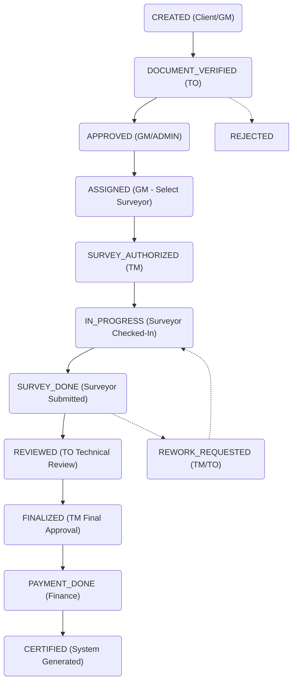

# GR-CLASS: Comprehensive Technical & Functional SRS

## 1. System Blueprint
GR-CLASS is a **Maritime Classification & Certification ERP**. It manages the technical health, regulatory compliance, and official documentation for commercial vessels.

### Core Tech Stack
- **Backend**: Node.js (v20+), Express.js (v5)
- **Database**: MySQL 8.0 (Sequelize ORM)
- **Caching**: Redis
- **Cloud**: AWS (S3 for documents, SES for Email)
- **Mobile Support**: Optimized API for offline-first surveyor apps.

---

## 2. User Roles & Permission Matrix
The system uses **Role-Based Access Control (RBAC)**. Each role has a specific "Data Scope".

| Role | Meaning | Responsibilities | Data Scope |
| :--- | :--- | :--- | :--- |
| `ADMIN` | Administrator | Total system control. | Global |
| `GM` | Gen. Manager | Business flows, Client/Surveyor onboarding, Job Approval. | Global |
| `TM` | Tech. Manager | Technical oversight, Final Survey Approval, Cert Issuance. | Global |
| `TO` | Tech. Officer | **Document Verification**, Technical review of checklists. | Global |
| `SURVEYOR`| Inspector | Performing vessel surveys, uploading reports. | Assigned Jobs Only |
| `CLIENT` | Ship Owner | Vessel management, requesting surveys, cert downloads. | Own Organization Only|
| `FLAG_ADMIN`| Port State | Regulatory oversight of vessels under their flag. | Flag-Specific |

---

## 3. The "Engine": Workflow Cycles

### 3.1 Job Request Lifecycle
This is the primary state machine of the application.

### 3.2 Surveyor Field Workflow (Hybrid Digital-Physical)
To satisfy maritime legal requirements for wet signatures on complex layouts, the system uses a hybrid approach:
1.  **Check-in**: Surveyor hits `POST /surveys/start`. Start GPS and timestamp recorded.
2.  **Digital Summary**: Surveyor marks high-level sections (e.g., Hull, Engine) as Pass/Fail in the app for instant reporting.
3.  **Audit Flow**: Surveyor downloads master blank templates (`template_files` - JSON array), prints/signs them, and uploads scanned copies (`signed_checklist_files` - JSON array) per job.
4.  **Signature**: Surveyor and Vessel Master sign and stamp the physical papers.
5.  **Digitization**: Surveyor uploads the scanned/photographed **Signed Checklists** to the job (`PUT /surveys/jobs/:id/signed-checklist`).
6.  **Check-out**: Surveyor submits the final survey report.

---

## 4. Module API Reference

### 4.1 Authentication (`/auth`)
- `POST /auth/login`: Identity verification.
- `POST /auth/refresh-token`: Renew short-lived access tokens.
- `POST /auth/logout`: Revoke tokens and clear cookies.
- `POST /auth/forgot-password`: Email-based reset.

### 4.2 Job Management (`/jobs`)
| Method | Endpoint | Description | Roles |
| :--- | :--- | :--- | :--- |
| `GET` | `/` | List jobs with status/client filters. | All (Scoped) |
| `POST` | `/` | Request a new survey/cert. | CLIENT, GM, ADMIN |
| `PUT` | `/:id/verify-documents` | Mark docs as checked. | TO |
| `PUT` | `/:id/approve-request` | Approve for surveyor assignment. | GM |
| `PUT` | `/:id/assign` | Link a Surveyor to the job. | GM |
| `PUT` | `/:id/authorize-survey` | Unlocks survey flow for surveyor. | TM |
| `PUT` | `/:id/review` | Mark technical review complete. | TO |
| `PUT` | `/:id/finalize` | Final signature before billing. | TM, GM |
| `PUT` | `/:id/priority` | Update job urgency (URGENT/NORMAL).| GM, TM |

### 4.3 Survey Operations (`/surveys`)
- `POST /surveys/start`: Record check-in coordinates.
- `POST /surveys/jobs/:id/proof`: Upload evidence photo (S3).
- `POST /surveys/jobs/:id/location`: Stream GPS pings during inspection.
- `POST /surveys/jobs/:id/sync`: Bulk upload offline-cached data.
- `PUT /surveys/jobs/:id/finalize`: TM command to lock the report.

### 4.4 Certification Engine (`/certificates`)
- `GET /certificates/types`: List available certs (e.g., Annual, Interim).
- `POST /certificates/`: Generate a draft from job data.
- `POST /certificates/:id/issue`: Converts draft to official Signed PDF.
- `GET /certificates/verify/:number`: Public endpoint for QR verification.
- `PUT /certificates/:id/renew`: Start renewal workflow (extends expiry).

### 4.5 Client & Vessel Management (`/vessels`, `/clients`)
- `GET /vessels`: List vessels (Filter by Flag, Age, Client).
- `POST /vessels`: Register new vessel info + IMO number.
- `GET /clients/:id`: View company details & primary contacts.
- `PUT /clients/:id/status`: Suspend/Activate organization.

### 4.6 Supporting Modules
- **Non-Conformities**: `GET /non-conformities` (List vessel deficiencies identified in survey).
- **Checklists**: `GET /checklist-templates` (Admin config for survey questions).
- **Dashboard**: `GET /dashboard` (Role-specific counters for Pending Tasks, Expiring Certs).

---

## 5. Technical Constraints for Frontend Implementation

### 5.1 Success/Error Handling
The backend always responds with a standardized wrapper:
- **Status 200/201**: Success. `json.success = true`.
- **Status 400**: Validation Error (Check `json.message` for Joi details).
- **Status 401/403**: Auth/RBAC issues.
- **Status 404**: Item not found.

### 5.2 Document Uploads
The backend uses **Pre-signed URLs** for maximum performance.
1.  Frontend requests `GET /api/v1/certificates/upload-url`.
2.  Backend returns an S3 `uploadUrl` and a `fileKey`.
3.  Frontend performs `PUT` to AWS S3 directly.
4.  Frontend notifies Backend with `fileKey` in the final `POST`.

### 5.3 Offline Synchronization
Surveyors often work in areas with 0 connectivity. The Frontend should:
- Cache Checklist data locally (IndexedDB/Redux Persist).
- Store GPS points with timestamps.
- Use `POST /surveys/jobs/:id/sync` to replay the entire session once online.

---

## 6. Role-Based Navigation Mapping (Checklist)

### Client Panel
- [ ] View Dashboard (My Vessels, Active Jobs).
- [ ] Request New Job.
- [ ] Upload Vessel Supporting Docs.
- [ ] Download Issued Certificates.

### Admin/Manager Panel (GM/TM)
- [ ] List all Client Requests (New).
- [ ] Assign Surveyors (Map integration recommended).
- [ ] Review Surveyor Submissions (Photo gallery view).
- [ ] Audit Logs & Report Builder.

### Surveyor Panel (The "Field Unit")
- [ ] View Assigned Jobs Calendar.
- [ ] Interactive Checklists (Toggle switch for Pass/Fail).
- [ ] Camera Integration (Evidence).
---

## 7. Complete Route Dictionary (Exhaustive List)

| Module | Method | Path | Required Role(s) |
| :--- | :--- | :--- | :--- |
| **Auth** | POST | `/auth/login` | Public |
| | POST | `/auth/refresh-token` | Public |
| | POST | `/auth/logout` | All |
| **Vessels** | GET | `/vessels` | ADMIN, GM, TM, TO, CLIENT |
| | POST | `/vessels` | ADMIN, GM, TM |
| | GET | `/vessels/:id` | ADMIN, GM, TM, TO, SURVEYOR, CLIENT |
| | PUT | `/vessels/:id` | ADMIN, GM, TM |
| **Jobs** | GET | `/jobs` | All (Scoped) |
| | POST | `/jobs` | CLIENT, ADMIN, GM |
| | PUT | `/jobs/:id/verify-documents` | TO |
| | PUT | `/jobs/:id/approve-request` | GM |
| | PUT | `/jobs/:id/assign` | GM |
| | PUT | `/jobs/:id/authorize-survey` | TM |
| | PUT | `/jobs/:id/review` | TO |
| | PUT | `/jobs/:id/finalize` | TM, GM |
| **Surveys** | POST | `/surveys/start` | SURVEYOR |
| | POST | `/surveys/jobs/:id/proof` | SURVEYOR |
| | GET | `/surveys/jobs/:id/signed-checklist-upload-url` | SURVEYOR |
| | PUT | `/surveys/jobs/:id/signed-checklist` | SURVEYOR |
| | POST | `/surveys/jobs/:id/location` | SURVEYOR |
| | POST | `/surveys/jobs/:id/sync` | SURVEYOR |
| | POST | `/surveys` | SURVEYOR (Final Submission) |
| | PUT | `/surveys/jobs/:id/finalize` | TM |
| **Certificates**| GET | `/certificates/types` | All (Scoped) |
| | POST | `/certificates` | TM, GM |
| | POST | `/certificates/:id/issue` | GM |
| | GET | `/certificates/:id/download`| All (Scoped) |
| | PUT | `/certificates/:id/suspend` | TM |
| | PUT | `/certificates/:id/revoke` | TM |
| **Clients** | GET | `/clients` | ADMIN, GM, TM, TO |
| | POST | `/clients` | ADMIN, GM, TM |
| | GET | `/clients/:id` | ADMIN, GM, TM, TO |
| **Users** | GET | `/users/me` | All |
| | GET | `/users` | ADMIN |
| | POST | `/users` | ADMIN |
| **Payments** | GET | `/payments` | ADMIN, GM, TM |
| | POST | `/payments` | ADMIN, CLIENT (Trigger) |
| **Support** | POST | `/support/tickets` | All |
| | GET | `/support/tickets` | ADMIN, GM (Staff view) |
| **System** | GET | `/system/health` | Public |
| | GET | `/system/audit-logs` | ADMIN |
| | GET | `/system/metrics` | ADMIN |
| **Feedback** | POST | `/customer-feedback` | CLIENT |
| | GET | `/customer-feedback` | ADMIN, GM |
| **Search** | GET | `/search` | All (Scoped) |
| **Dashboard** | GET | `/dashboard` | All (Role-specific) |

