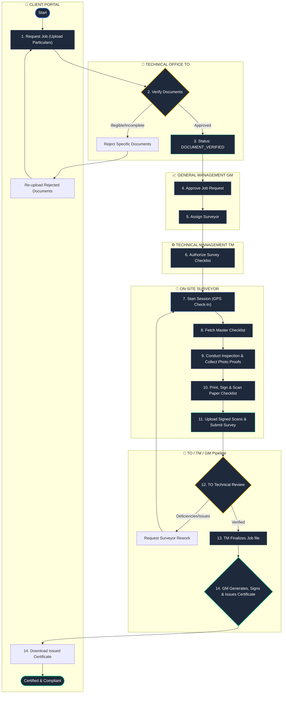

# 🚢 GR-Class Marine Certification & Operations Management System
## 📋 Complete Master User Guide (Client & Internal Operations)

> **Document Version:** 1.0.0  
> **Release Date:** May 2026  
> **Target Audience:** External Clients (Shipowners/Operators) & Internal Technical/Management Staff  

---

## 🌟 1. System Overview

**GR-Class** is a modern, enterprise-grade maritime compliance and classification portal. It streamlines the statutory and class certification lifecycle of commercial marine vessels. By integrating robust digital workflows with real-world marine survey requirements, GR-Class ensures maritime compliance through data integrity, role-based security, and rigorous double-verification.

### Core Architecture Pillars
1. **Double-Verification Auditing:** Ensures all technical document submissions and surveys undergo independent validation (Technical Officer ➡️ Technical Manager ➡️ General Manager) before certificates are signed and issued.
2. **Geo-Fenced Surveyor Verification:** Uses GPS tracking to verify that marine surveyors are physically on-site (within a designated radius of the vessel) before they can initiate inspections.
3. **Digital-Physical Hybrid Checklist:** Combines digital data entry with physical, wet-ink signature scans to maintain legal audit trails while enabling quick database queries.
4. **Resilient Session Security:** Role-segregated authorization prevents credential bleed across devices and utilizes automated, silent token refresh queues to keep active sessions alive seamlessly.

---

## 👥 2. Role-Based Access Matrix

GR-Class divides operational duties among six distinct roles to maintain a strict **Segregation of Duties (SoD)**. No single role—including system administrators—can bypass these built-in authority gates.

| Role | Role Code | Primary Purpose | Key Responsibilities |
| :--- | :--- | :--- | :--- |
| **Ship Owner / Operator** | `CLIENT` | External Customer | Fleet management, booking surveys, uploading drawings, making payments, downloading certificates. |
| **Technical Officer** | `TO` | Frontline Desk Reviewer | Document verification, survey report technical review, logging and closing Non-Conformities (NCs). |
| **Technical Manager** | `TM` | Technical Authority | Surveyor applications, managing checklist templates, authorizing survey checklists, finalizing job files. |
| **General Manager** | `GM` | Operational Director | Survey request approvals, surveyor assignments, invoice creation, billing, signing & issuing certificates. |
| **Marine Surveyor** | `SURVEYOR` | Field Operations | Conducting on-site physical inspections, filling out digital checklists, uploading wet-signature scans. |
| **System Administrator** | `ADMIN` | System Governance | Full technical controls, database diagnostics, user provisioning, security, localized translations, audit trails. |

---

## 🔄 3. End-to-End Survey & Certification Lifecycle

The lifecycle of a Marine Certification Job traverses a strict state machine to guarantee that all security, technical, and financial controls are met.

---

## 💻 4. Step-by-Step User Guides by Role

---

### 4.1 Shipowner / Operator (`CLIENT`) User Guide

As a Shipowner or Vessel Operator, the Client Portal is your self-service command center. Here you register your fleet, submit inspection requests, upload vessel drawings, settle outstanding invoices, and download official certificates.

#### Step 1: Navigating the Fleet Dashboard
1. Log in to the client portal using your credentials.
2. The homepage provides real-world **Fleet Health Metrics**:
   - Total Vessels under Management
   - Active Survey Jobs
   - Expiring Certificates (within 90 days)
   - Unpaid Invoices count

#### Step 2: Registering a Vessel
1. Go to the **Vessels** tab in the sidebar navigation.
2. Click the **Register Vessel** button at the top-right.
3. Input the vessel details:
   - **Vessel Name:** Official registered name.
   - **IMO Number:** Unique 7-digit International Maritime Organization number.
   - **Vessel Type:** Choose from dropdown (e.g., Bulk Carrier, Tanker, Container, Tug).
   - **Gross Tonnage & Year of Build.**
4. Click **Submit**. The vessel is now listed in your fleet with immediate access to statutory history.

#### Step 3: Requesting a Survey & Uploading Documents
1. Go to the **Jobs** tab.
2. Click **Book Survey Job** to open the wizard modal.
3. Select the **Vessel** requiring inspection.
4. Choose the **Certificate Type** required (e.g., *Safety Equipment Certificate*).
5. Specify the **Target Port** and **Target Date** when the vessel will be accessible.
6. **Required Documents:** The system will dynamically display a list of mandatory documentation (e.g., General Arrangement Plan, Fire Control Plan). You must upload clear PDFs or high-resolution images for each item.
7. Add any custom additional documents (e.g., previous class certificates) by typing a custom document name and uploading the file.
8. Click **Request Job**. The job status initializes as `CREATED`.

#### Step 4: Resolving Rejected Documents
If a Technical Officer (TO) flags a document as blurry or invalid:
1. You will receive an email/dashboard alert.
2. Navigate to **Jobs ➡️ Job Details ➡️ Documents Tab**.
3. View the document labeled `REJECTED` and check the **Rejection Reason** (e.g., *"Fire Control Plan is missing stamp signatures"*).
4. Click **Re-upload**, select a new, corrected file, and upload it.
5. The document status resets to `PENDING` for re-verification. The job status remains safe in `CREATED` during this loop.

#### Step 5: Managing Billing & Payments
1. Go to the **Payments** tab.
2. Review the transactional ledger showing all issued invoices.
3. Select an invoice with status `UNPAID` to view:
   - **Service Description** (e.g., *Annual Safety Equipment Survey*)
   - **Billed Amount & Currency**
4. Settle payments through your standard accounts department.
5. Once marked paid by management, the invoice status changes to `PAID`, unlocking subsequent certificate releases.

#### Step 6: Downloading & Verifying Certificates
1. Go to the **Certificates** tab.
2. Click **Download** on any `VALID` certificate to obtain the secure PDF.
3. **Public Verification:** Any external port state authority or auditor can verify the certificate's validity instantly without logging in. Point them to the public link: `https://[portal-domain]/public/certificate/verify/[Certificate_Number]` which displays the live validity status, vessel IMO, and authority details.

---

### 4.2 Technical Officer (`TO`) User Guide

As a Technical Officer, you are the technical gatekeeper. You conduct desk reviews of client documents, verify submitted survey reports, and manage Non-Conformities (NCs) to ensure strict adherence to maritime conventions.

#### Step 1: Document Verification Loop
1. Navigate to the **Verification Queue** or **Jobs** tab.
2. Select a job in `CREATED` status.
3. Open the **Documents** tab to view the list of files uploaded by the client.
4. Click on each document to inspect the signed S3 file.
5. **If a document is invalid:**
   - Click **Reject Document**.
   - Input a clear, specific rejection reason explaining exactly what needs correction.
   - Click Submit. (The job remains in `CREATED` status, and the client is automatically alerted to re-upload).
6. **If all documents are valid:**
   - Click **Approve Documents**.
   - The document statuses turn to `APPROVED`, and the job automatically transitions to `DOCUMENT_VERIFIED`.

#### Step 2: Technical Survey Report Review
Once a Surveyor completes their physical inspection and submits their report, the job status becomes `SURVEY_DONE`.
1. Go to the **Technical Review** tab.
2. Open the job file.
3. Compare the **Digital Checklist Answers** submitted by the surveyor against the **Uploaded Signed Physical Scan**.
4. Cross-examine all photo evidence provided for deficiencies.
5. **If errors are detected:**
   - Click **Send Back for Rework**.
   - Input detailed technical reasons for the surveyor to address (e.g., *"Photo proof for lifeboats is missing. Please recheck on board"*). The status returns to `IN_PROGRESS`.
6. **If correct:**
   - Click **Approve Technical Report**. The job is forwarded to the Technical Manager for finalization.

#### Step 3: Raising & Closing Non-Conformities (NCs)
If you detect statutory failures during your review, or if the surveyor reports outstanding deficiencies:
1. Go to the **Non-Conformities** tab within the Job Details.
2. Click **Raise Non-Conformity**.
3. Fill out the details:
   - **Description:** Clear citation of the deficiency (e.g., *"Emergency exit sign on Deck 2 is burnt out"*).
   - **Severity:** Select `MINOR`, `MAJOR`, or `CRITICAL`.
4. Click **Submit**. This locks the job from finalized certification.
5. **Closing an NC:** Once the surveyor uploads photo proof of the repair:
   - Select the open NC.
   - Input **Closure Remarks** (e.g., *"Verified replacement photo. Exit sign is now operational"*).
   - Click **Close NC**.

---

### 4.3 General Manager (`GM`) User Guide

As the General Manager, you are the operations and financial director. You review validated requests, coordinate surveyor logistics, manage invoicing, and execute final certificate signatures.

#### Step 1: Job Approval Queue
1. Navigate to the **Approval Queue** or **Jobs** page.
2. Filter by status `DOCUMENT_VERIFIED`.
3. Review the vessel history, target port, and scope of work.
4. Click **Approve Request**. The job transitions to `APPROVED`.

#### Step 2: Assigning Port Surveyors
1. On the approved job detail page, click the **Assign Surveyor** button.
2. The portal will display an interactive list of active surveyors, filtered by proximity to the target port.
3. Select the appropriate surveyor.
4. Click **Assign**. The job status changes to `ASSIGNED`, and the surveyor is notified immediately.
5. **Reassignment (If required):** If the surveyor reports a conflict, click **Reassign**, input a valid reason for the operational audit trail, and select a new surveyor.

#### Step 3: Billing, Invoicing & Payments
1. Go to the **Payments** tab.
2. Select **Create Invoice** for the corresponding Job.
3. Input the required parameters:
   - **Amount**
   - **Currency** (USD, EUR, SGD, etc.)
   - **Payment Terms & Descriptions**
4. Click **Generate Invoice**.
5. **Settling Balances:** Once payment is confirmed by your bank:
   - Locate the invoice ledger.
   - Click **Mark as Paid** or open the **Mark Paid Modal** for partial/split accounting options.
   - Settle the invoice. This marks the job's financial obligations as met.

#### Step 4: Signing & Issuing Certificates
Once the survey is finalized by the Technical Manager:
1. Navigate to the **Certificates** tab.
2. Locate the certificate in `DRAFT` status.
3. Click **Issue Certificate**. This will dynamically generate the high-resolution, print-ready PDF certificate containing all vessel dimensions and validity periods.
4. Click **Digitally Sign Certificate** to apply the official classification society seal and cryptography. The status transitions to `VALID` (or `CERTIFIED`), immediately making it available in the Client's portal.

---

### 4.4 Technical Manager (`TM`) User Guide

As the Technical Manager, you hold technical oversight. You manage surveyor accounts, curate checklist templates, authorize the release of survey forms, and approve final job records.

#### Step 1: Surveyor Onboarding & Applications
1. Go to the **Surveyor Applications** queue.
2. Select an application submitted by a prospective surveyor.
3. Download and inspect their CV and certificates of competency.
4. Click **Approve Application** to automatically provision a system account with `SURVEYOR` role restrictions.

#### Step 2: Creating & Curating Checklist Templates
Checklist templates are the core inspection rules applied on-site.
1. Navigate to the **Checklist Templates** tab.
2. Click **Create Template**.
3. Input:
   - **Name:** (e.g., *Safety Radio Inspection Checklist*)
   - **Checklist Code:** Unique short code (e.g., *RADIO_SEC_001*)
   - **Certificate Type Association:** Connect this template to a specific statutory certificate.
4. Create **Sections** (e.g., *Transceivers*, *Batteries*, *GMDSS*).
5. Add **Checklist Items** to each section, defining their input types:
   - `YES_NO_NA` (Radio options)
   - `NUMBER` (Numeric inputs like counts or voltages)
   - `TEXT` (Free-form descriptive notes)
6. Set status to `ACTIVE`. The system will now automatically attach this checklist to all subsequent jobs requested for this certificate type.

#### Step 3: Authorizing Surveyor Checklists
To prevent unauthorized field actions:
1. Go to the **Authorize Queue**.
2. Select a job in `ASSIGNED` status.
3. Click **Authorize Survey**. This unlocks the template, enabling the assigned surveyor to check-in and start editing.

#### Step 4: Final Technical Review & Job Finalization
After the Technical Officer approves the report:
1. Navigate to the **Jobs** tab and filter by `REVIEWED`.
2. Review the unified compliance files.
3. Click **Finalize Job**. The job transitions to `FINALIZED`, prompting the creation of the certificate draft and readying it for the GM's signature.
4. **Triggering Rework:** If you notice incomplete data:
   - Click **Request Rework**.
   - Specify the technical gaps. The job transitions back to `IN_PROGRESS` for the surveyor's correction.

---

### 4.5 Marine Surveyor (`SURVEYOR`) User Guide

As an on-site Marine Surveyor, you execute the physical fieldwork. The system is designed to support offline capabilities and hybrid digital-physical inputs during inspections.

> [!IMPORTANT]
> **Geo-Fencing Rule:** The portal tracks your live GPS location. You must be physically present within the defined radius of the vessel at the port to start a survey session.

#### Step 1: GPS Check-In (Starting the Session)
1. Go to your **My Assigned Jobs** list on your mobile browser or tablet.
2. Select the authorized job.
3. Click **Start Survey Session**. The system captures your device's current latitude and longitude and verifies it against the vessel's reported port coordinates.
4. Once verified, the job status shifts to `IN_PROGRESS`.

#### Step 2: Fetching Checklist Templates & Blanks
1. In the active job, go to the **Checklist** tab.
2. The portal will display the structured sections mapped by the Technical Manager.
3. Click **Download Master Blank**. This downloads a printable PDF of the inspection template for your clipboard if you prefer carrying a physical sheet on deck.

#### Step 3: Conducting Inspections & Filling Checklists
1. Inspect the vessel. For each item on the digital form, input the corresponding answers:
   - **Yes/No/NA:** Select appropriate option. Provide remarks for any `NO` answers or failures.
   - **Numbers:** Enter measured values (e.g., lifeboat counts, fire nozzle diameters).
   - **Text:** Input descriptions of equipment setups.
2. Go to **Evidence Upload** to attach photo proof of critical compliance components (e.g., lifeboat launch tests). The system provides secure S3 upload paths.

#### Step 4: Physical-Digital Hybrid Verification (Signed Scans)
To maintain structural compliance:
1. Fill out your physical clipboard checklist sheet.
2. Obtain the vessel Master's physical wet-ink signature and ship stamp on the paper copy.
3. Use your device's camera to scan the signed document.
4. Under the **Signed Scans** section in the portal, click **Upload Signed Checklist Scan**.
5. Upload the PDF/Image scan.

#### Step 5: Submitting the Survey Report
1. Verify that all mandatory questions are answered.
2. Confirm at least one photo proof or signed scan is successfully attached.
3. In the survey summary, click **Submit Survey Report**.
4. The job status shifts to `SURVEY_DONE` and is queued for the Technical Officer's review. You will be locked from further edits unless a technical manager requests a rework.

---

## 🎨 5. User Interface & Platform Controls

The GR-Class portal features a state-of-the-art **Premium Dark UI** modeled on modern carbon themes, offering sleek aesthetics and maximum legibility in harsh marine light conditions.

### Key UI Features
* **Glassmorphism Design:** Core layout cards utilize frosted-glass properties (`backdrop-filter`) floating over smooth slate gradients, providing high contrast and visual hierarchy.
* **Unified Dashboard Grid:** Reuses a standardized component library across all five internal panels. Graphs dynamically scale using responsive CSS grids.
* **Status Badge Matrix:** Unified colors for fast operational reading:
  - `CREATED`: Frosted Amber Badge 🟡
  - `APPROVED`: Sleek Violet Badge 🟣
  - `ASSIGNED`: Deep Blue Badge 🔵
  - `IN_PROGRESS`: Active Ocean-Blue Spin Badge 🔄
  - `SURVEY_DONE`: Cyan Teal Badge 🟢
  - `REWORK_REQUIRED`: Soft Crimson Pulse Badge 🔴
  - `FINALIZED`: Emerald Green Badge ✅
  - `CERTIFIED` / `VALID`: Brilliant Neon Green Badge ❇️
* **Responsive Sidebar Guards:** Adaptive navigation panels collapse seamlessly on tablets and smartphones during surveyor deck operations.

---

## ⚙️ 6. System Security & Under-the-Hood Controls

### 1. Role-Isolated Local Storage
To prevent access control creep and credential bleed on shared port office terminals, GR-Class segregates access tokens by namespaces. The web browser writes JWT tokens to specific prefixes based on the authenticated role:

| Prefix | localStore Namespace Example | Affected Portal |
| :--- | :--- | :--- |
| `ADMIN` | `accessToken` | System Administration Portal |
| `GM` | `gm_accessToken` | General Operations Portal |
| `TM` | `tm_accessToken` | Technical Management Portal |
| `TO` | `to_accessToken` | Engineering Verification Portal |
| `CLIENT`| `client_accessToken` | Customer Self-Service Portal |

### 2. Silent 401 Token Refresh Interceptor
If your session token expires mid-use, the system's Axios interceptor prevents data loss by:
1. Pausing all current outgoing database calls and saving them in an internal queue.
2. Instantly requesting a silent update via `POST /auth/refresh-token`.
3. Upon receiving a new session JWT, it automatically replays all paused operations without showing interruptive loading screens.
4. If your session is completely terminated or the refresh token expires, it securely purges local namespaces and redirects to the landing page `/`.

---

## ❓ 7. Troubleshooting & FAQ

### Q1: "Access Denied / 403 Forbidden Error" appears when opening a link.
* **Why it happens:** The URL belongs to a role you do not hold (e.g., a Client trying to view `/admin/users` or a Technical Officer trying to open the `/reports` revenue page).
* **Resolution:** Return to your role's specific dashboard. Check your role permissions in **Profile Settings**.

### Q2: The system refuses to let me submit a survey.
* **Why it happens:**
  1. The certificate type requires a checklist, but no checklist template has been uploaded or activated.
  2. You have not uploaded the mandatory **Signed Physical Checklist Scan**.
  3. One or more mandatory checklist items were left unanswered.
* **Resolution:** Check that all sections show green checkmarks. Ensure the physical scan file is attached and click submit again.

### Q3: File uploads are failing.
* **Why it happens:**
  1. The file size exceeds the strict **20MB file limit**.
  2. The file extension is not an approved extension (approved: `.pdf`, `.jpg`, `.jpeg`, `.png`, `.webp`). Executable file types (`.exe`, `.js`, etc.) are blocked by firewall scripts.
* **Resolution:** Compress your PDFs/scans to stay under the 20MB limit and verify the file extension before uploading.

### Q4: "GPS Range Violation" warning blocks surveyor check-in.
* **Why it happens:** The coordinates captured by your mobile browser are outside the allowed radius (e.g., 500 meters) of the port where the vessel is docked.
* **Resolution:** Ensure GPS/Location services are enabled on your device. Stand in an open deck area with a clear line of sight to satellite networks and retry. If the port coordinates are wrong in the database, contact the Technical Manager to adjust the rule's radius parameters.

---

> [!NOTE]  
> *For further system support or to report statutory exceptions, please submit a ticket in the **Support Tickets** tab (Client panel) or contact your designated Technical Officer directly.*
