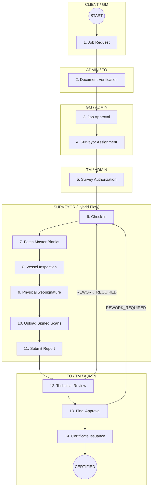

# GR-CLASS: Complete Job Lifecycle & API Flow

This document provides a single-source-of-truth for the entire lifecycle of a Maritime Certification Job, from initial request to official certificate issuance.

---

## 🏗️ 1. High-Level Process Map

---

## 🛠️ 2. Step-by-Step API Guide

### Phase 1: Initiation & Planning
| Step | Action | Endpoint | Role | Status Change |
| :--- | :--- | :--- | :--- | :--- |
| 1 | **Request Job** | `POST /api/v1/jobs` | CLIENT | `CREATED` |
| 2 | **Update Priority** | `PUT /api/v1/jobs/:id/priority` | GM | `URGENT / NORMAL` |
| 3 | **Verify Docs** | `PUT /api/v1/jobs/:id/verify-documents` | TO | `DOCUMENT_VERIFIED` |
| 4 | **Approve** | `PUT /api/v1/jobs/:id/approve-request` | GM | `APPROVED` |
| 5 | **Assign** | `PUT /api/v1/jobs/:id/assign` | GM | `ASSIGNED` |

### Phase 2: Authorization & Field Work (The Hybrid Flow)
| Step | Action | Endpoint | Role | Notes |
| :--- | :--- | :--- | :--- | :--- |
| 6 | **Authorize** | `PUT /api/v1/jobs/:id/authorize-survey` | TM | Unlocks surveyor actions. |
| 7 | **Check-in** | `POST /api/v1/surveys/start` | SURVEYOR | Records GPS/Timestamp. |
| 8 | **Fetch Templates**| `GET /api/v1/checklist-templates/job/:id`| SURVEYOR | Downloads PDF/Docs blanks. |
| 9 | **Upload Evidence**| `POST /api/v1/surveys/jobs/:id/proof` | SURVEYOR | On-site photos. |
| 10 | **Upload Scans** | `PUT /api/v1/surveys/jobs/:id/signed-checklist`| SURVEYOR | **[New]** Scanned wet-signatures. |
| 11 | **Submit Report** | `POST /api/v1/surveys` | SURVEYOR | Moves to `SURVEY_DONE`. |

### Phase 3: Review, Rework & Certification
| Step | Action | Endpoint | Role | Status Change |
| :--- | :--- | :--- | :--- | :--- |
| 12 | **Tech Review** | `PUT /api/v1/jobs/:id/review` | TO | `REVIEWED` |
| 13 | **Request Rework**| `PUT /api/v1/surveys/jobs/:id/rework` | TO/TM | Back to `IN_PROGRESS`. |
| 14 | **Finalize** | `PUT /api/v1/surveys/jobs/:id/finalize` | TM | `FINALIZED` |
| 15 | **Draft Cert** | `POST /api/v1/certificates` | GM/TM | Creates cert draft. |
| 16 | **Issue Cert** | `POST /api/v1/certificates/:id/issue` | GM/TM | **FINISH** (Watermark off). |

---

## 📂 3. Document Requirements per Role

### For CLIENT
- Upload Vessel Particulars (Registration, Drawings) during initiation.
- Download issued certificates once the job is `CERTIFIED`.

### For SURVEYOR (Hybrid workflow)
1. **Check-in**: Must be within GPS range of the vessel.
2. **Master Templates**: Download the `template_files` provided by Admin.
3. **Wet Signatures**: Print, sign physically, and scan.
4. **Digitization**: Upload the scans via `signed-checklist` API.
5. **Double-Check**: Ensure all non-conformities are logged before submission.

### For MANAGEMENT (GM/TM/TO)
- **TO**: Cross-verify "Digital Yes/No" with the "Scanned Document" findings.
- **TM**: Final quality gate. Can trigger **Rework** if the signed scan is blurry or incomplete.

---

## 🔄 4. State Machine Summary
| Status | Meaning |
| :--- | :--- |
| `CREATED` | New request from Client. |
| `APPROVED` | GM has cleared the financial/admin check. |
| `ASSIGNED` | Surveyor is selected. |
| `IN_PROGRESS` | Surveyor has checked-in and is working. |
| `SURVEY_DONE` | Report submitted, pending technical review. |
| `REWORK_REQUIRED`| Report sent back to Surveyor for corrections. |
| `FINALIZED` | Technical and Management approval complete. |
| `CERTIFIED` | Official certificate has been issued. |

---

> [!IMPORTANT]
> **Data Integrity Rule**: A survey cannot be submitted (`SURVEYOR`) unless at least one proof or signed checklist scan is present if the "Digital-Physical Hybrid" mode is enabled.
 is enabled.
