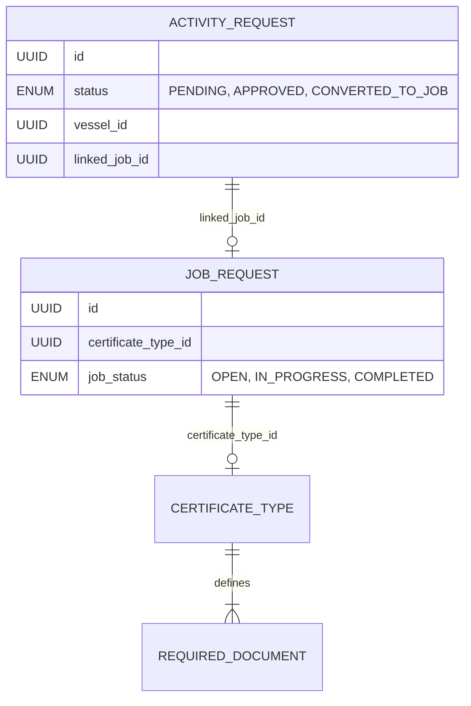

# Workflow: Activity Request to Job Conversion

This document details the end-to-end flow of how a client's informal service request is transformed into a formal, compliant maritime job within the GIRIK platform.

---

## 1. Overview
The **Activity Request** acts as a "Pre-Sales" or "Intent" phase. It captures client needs without enforcing strict maritime compliance rules yet. The **Job Request** is the "Execution" phase, where strict rules (Certificates, Surveys, Documents) apply.

---

## 2. The Multi-Phase Flow

### Phase 1: Client Request (Informal)
*   **Actor**: Client User
*   **Action**: Submits a request via `POST /api/v1/activity-requests`.
*   **Logic**:
    *   Client selects a **Vessel**.
    *   Client provides a **Description** (e.g., "Requesting hull inspection for damage").
    *   **Certificate Type**: Not required at this stage (Optional).
    *   **Documents**: User can upload ad-hoc photos or notes as `attachments`.
*   **Result**: Status = `PENDING`.

### Phase 2: Internal Review (Governance)
*   **Actor**: Admin / Technical Manager (TM)
*   **Action**: Reviews the request details.
*   **Decision**: 
    *   `REJECT`: Status = `REJECTED` (with reason).
    *   `APPROVE`: Status = `APPROVED`.

### Phase 3: Conversion to Job (Formal Compliance)
*   **Actor**: Admin / Manager
*   **Action**: Clicks "Convert to Job" on an `APPROVED` request.
*   **Logic**:
    1.  **Certificate Selection**: Manager MUST select a `CertificateType` (e.g., *Hull Survey Certificate*).
    2.  **Job Creation**: A new record is created in `job_requests` table.
    3.  **Automatic Linking**: 
        *   `JobRequest.vessel_id` is copied from Activity Request.
        *   `ActivityRequest.linked_job_id` is updated with the New Job UUID.
        *   `ActivityRequest.status` changes to `CONVERTED_TO_JOB`.
    4.  **Document Activation**: 
        *   Based on the `CertificateType`, the system automatically fetches the **Required Documents List**.
        *   The Job Checklist is populated with these mandatory document placeholders.

---

## 3. Data Schema Relationship

---

## 4. Why are Certificates/Documents chosen at the Job level?

1.  **Technical Accuracy**: A client might ask for a "Hull Inspection," but the Technical Manager knows this actually requires an *Intermediate Survey Certificate* based on the ship's age. The Manager makes the final compliance decision.
2.  **Automation**: By linking the Certificate Type at the Job level, the platform can automatically generate:
    *   The **Surveyor Checklist**.
    *   The **Invoicing Amount** (linked to the certificate type fees).
    *   The **Required Documents** portal for the client.

---

## 5. Frontend Implementation Checklist

- [ ] **Request Form**: Lightweight (Vessel, Date, Description).
- [ ] **Admin Approval Dashboard**: Status badges and "Approve/Reject" actions.
- [ ] **Conversion Modal**: When converting, show a dropdown to select `CertificateType`.
- [ ] **Job Detail Page**: If `linked_job_id` exists, show a "Source Request" breadcrumb.
- [ ] **Request Detail Page**: If `status === 'CONVERTED_TO_JOB'`, show a link to the Job.
