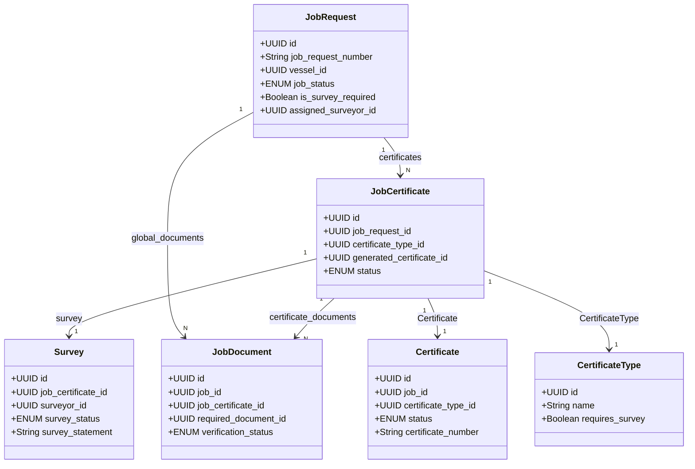

# TOCA (Transfer of Class Agreement) Multi-Certificate Workflow Guide
### Complete Backend Architecture, Lifecycles, and Multi-Certificate Synchronization

This document describes the design, database models, and step-by-step lifecycle flow for **Transfer of Class Agreement (TOCA)** and general job requests containing multiple certificates. In this architecture, a single master job request coordinates multiple certificates—each having its own survey checklists, uploads, and individual lifecycle tracking.

---

## 1. Entity Relationship Model

To support jobs with multiple certificates, the backend uses a hierarchical model structure. Instead of linking a survey or certificate directly to the main `JobRequest`, they are associated with a joining `JobCertificate` entity.



### Model Mapping Details
*   **[job_request.model.js](file:///Users/abhinavvishwakarma/Desktop/GIRIK_Workshop/GIRIK_BACKEND/src/models/job_request.model.js)**: The master container for the job. Coordinates overall routing statuses.
*   **[job_certificate.model.js](file:///Users/abhinavvishwakarma/Desktop/GIRIK_Workshop/GIRIK_BACKEND/src/models/job_certificate.model.js)**: Links the job to requested certificate types. Represents the status of each certificate's progress.
*   **[survey.model.js](file:///Users/abhinavvishwakarma/Desktop/GIRIK_Workshop/GIRIK_BACKEND/src/models/survey.model.js)**: Tracks surveyor site logs, checklists, signatures, and proofs specifically for a `JobCertificate`.
*   **[job_document.model.js](file:///Users/abhinavvishwakarma/Desktop/GIRIK_Workshop/GIRIK_BACKEND/src/models/job_document.model.js)**: Stores uploaded PDF/Image files. Documents can be global (`job_certificate_id = null`) or mapped to a specific certificate.
*   **[certificate.model.js](file:///Users/abhinavvishwakarma/Desktop/GIRIK_Workshop/GIRIK_BACKEND/src/models/certificate.model.js)**: The final issued statutory certificate record.

---

## 2. Core Lifecycles and Invariant Guard States

The backend enforces two distinct state machines that synchronize dynamically.

### Job Status Transitions
Enforced centrally in **[lifecycle.service.js](file:///Users/abhinavvishwakarma/Desktop/GIRIK_Workshop/GIRIK_BACKEND/src/services/lifecycle.service.js)**:
```
CREATED → DOCUMENT_VERIFIED → APPROVED → ASSIGNED → SURVEY_AUTHORIZED → IN_PROGRESS → SURVEY_DONE
                                                                          ↓
                                                          FINALIZED ← REVIEWED
                                                              ↓
                                                          CERTIFIED (terminal)
```
*Note: At any non-terminal stage, the job can be set to `REJECTED`. If changes are needed during survey review, the job can move to `REWORK_REQUESTED`.*

### Survey Status Transitions
Enforced centrally in **[lifecycle.service.js](file:///Users/abhinavvishwakarma/Desktop/GIRIK_Workshop/GIRIK_BACKEND/src/services/lifecycle.service.js)**:
```
NOT_STARTED → STARTED → CHECKLIST_SUBMITTED → PROOF_UPLOADED → SUBMITTED → FINALIZED
                                                                  ↕
                                                           REWORK_REQUIRED
```

### Multi-Certificate Synchronization Rules
1.  **Survey Provisioning**: When the job is transitioned to `SURVEY_AUTHORIZED`, the database automatically generates a separate `Survey` row for each `JobCertificate` (if the certificate type requires survey).
2.  **Job Progress Sync (`IN_PROGRESS`)**: As soon as the surveyor begins/starts the **first** survey (`STARTED`), the master `JobRequest` transitions to `IN_PROGRESS`.
3.  **Job Execution Sync (`SURVEY_DONE`)**: The master `JobRequest` transitions to `SURVEY_DONE` **only when all** surveys associated with the job's certificates reach the `SUBMITTED` state.
4.  **Job Finalization Sync (`FINALIZED`)**: The master `JobRequest` transitions to `FINALIZED` **only when all** surveys associated with the job's certificates are finalized by a Technical Manager (`TM`). Direct API calls to finalize a job request are blocked.
5.  **Rework Synchronization**: If a survey is marked `REWORK_REQUIRED` by a Manager, the main job transitions to `REWORK_REQUESTED`. This puts all non-finalized surveys in the job back into the `REWORK_REQUIRED` state so the surveyor can adjust and re-submit checklists/proofs.

---

## 3. End-to-End API Flow Matrix

| Phase | Step | HTTP Method & Endpoint | Allowed Roles | Description & Dynamic State Actions |
| :--- | :--- | :--- | :--- | :--- |
| **Phase 1: Initiation** | **1. Create Job** | `POST /api/v1/jobs` | `CLIENT`, `ADMIN`, `GM` | Creates a `JobRequest` (`CREATED`) and multiple `JobCertificate` entries. Validates mandatory documents. |
| | **2. Verify Docs** | `PUT /api/v1/jobs/:id/verify-documents` | `TO`, `ADMIN` | TO checks all uploads. Can approve (`DOCUMENT_VERIFIED`) or reject specific ones (`approved: false`) which alerts the client to re-upload. |
| | **3. Approve Job** | `PUT /api/v1/jobs/:id/approve-request` | `GM`, `ADMIN` | GM approves the request, transitioning the status to `APPROVED`. |
| **Phase 2: Assignment** | **4. Assign Surveyor** | `PUT /api/v1/jobs/:id/assign` | `GM`, `ADMIN` | Assigns `assigned_surveyor_id`. Enforces verification checks that the surveyor is Active, Online, and authorized for the ship type and all certificate types. Transition to `ASSIGNED`. |
| | **5. Authorize Survey** | `PUT /api/v1/jobs/:id/authorize-survey` | `TM`, `ADMIN` | Transition to `SURVEY_AUTHORIZED`. **Auto-provisions a `Survey` record for each `JobCertificate`.** |
| **Phase 3: Execution** | **6. Start Survey** | `POST /api/v1/surveys/start` | `SURVEYOR` | Surveyor checks in at site for a certificate. Transitions survey to `STARTED`. **First started survey moves the main job to `IN_PROGRESS`.** |
| | **7. Submit Checklist** | `POST /api/v1/checklists/:jobId` | `SURVEYOR` | Surveyor uploads checklist items for the specific certificate. Status becomes `CHECKLIST_SUBMITTED`. |
| | **8. Upload Proof** | `POST /api/v1/surveys/:id/proof` | `SURVEYOR` | Uploads photos/evidence. Status becomes `PROOF_UPLOADED`. |
| | **9. Submit Survey** | `POST /api/v1/surveys` | `SURVEYOR` | Checks out. Uploads attendance photo, signature, statement. Status becomes `SUBMITTED`. **Job becomes `SURVEY_DONE` when all surveys are `SUBMITTED`.** |
| **Phase 4: Verification** | **10. Tech Review** | `PUT /api/v1/jobs/:id/review` | `TO` | TO reviews the checklists and files. If correct, transitions the job to `REVIEWED`. |
| | **11. Send Rework** | `PUT /api/v1/surveys/:id/rework` | `TM`, `GM` | If a report is rejected, survey is marked `REWORK_REQUIRED` and job transitions to `REWORK_REQUESTED`. |
| **Phase 5: Lock-In** | **12. Finalize Survey** | `PUT /api/v1/surveys/:id/finalize` | **`TM` ONLY** | Enforces that there are no open Non-Conformities (NCs) on the vessel. Survey moves to `FINALIZED`. **Job moves to `FINALIZED` once all surveys are finalized.** |
| **Phase 6: Payment** | **13. Create Invoice** | `POST /api/v1/payments/invoice` | `ADMIN`, `GM`, `TM` | Generates a single invoice for the job. |
| | **14. Confirm Payment** | `PUT /api/v1/payments/:id/pay` | `ADMIN`, `GM`, `TM` | Marks invoice as paid. Transitions job to `PAYMENT_DONE`. |
| **Phase 7: Certification** | **15. Generate Drafts** | `POST /api/v1/certificates` | `TM`, `GM`, `ADMIN` | Called per `job_certificate_id`. Creates a `DRAFT` certificate. Populates docx template from S3 and uploads the generated file. Updates JobCertificate status to `ISSUED`. |
| | **16. Issue Certificates**| `PUT /api/v1/certificates/:id/issue` | `GM`, `ADMIN` | Changes Certificate status to `VALID`. **Once all drafts for the job are issued, the master JobRequest transitions to `CERTIFIED`.** |

---

## 4. Technical Invariants & Guard Checks

### Surveyor Authorization Validator
During the `assign` step, the backend matches the surveyor's profile authorizations against the vessel and requested certificates using **[job.service.js:L80-128](file:///Users/abhinavvishwakarma/Desktop/GIRIK_Workshop/GIRIK_BACKEND/src/modules/jobs/job.service.js#L80-L128)**:
*   **Vessel Type Match**: Checks if the surveyor's `authorized_ship_types` matches the vessel's `ship_type`.
*   **Certificate Match**: Checks if the surveyor's `authorized_certificates` covers the names of all the `CertificateType`s listed under the job's certificates.
*   **Status & Availability**: Surveyor profile status must be `ACTIVE` and `is_available` must be `true`.

### Non-Conformity (NC) Guard
Prior to finalization of a survey or issuance of a certificate, the database queries for any open non-conformities related to the vessel. If any unresolved findings are active, the transaction is rejected to prevent issuing compliance certifications to defective vessels.

### Document Filling and Storage Flow
1.  **Fetch Template**: The service checks for active templates in S3 based on the `certificate_type_id` and the selected term (`FULL_TERM` / `SHORT_TERM`).
2.  **Build Tags**: Standard tags (vessel name, IMO, call sign, builder, survey dates, port, surveyor name) are compiled from the database using the tag builder utility.
3.  **Docx Generation**: The docx file is populated using XML content control replacement and uploaded back to S3 under `public/certificates/`.
4.  **CDN / Signed URL Routing**: Publicly verifiable files get cached via CDN, while internal/restricted records are fetched through signed temporary URLs generated on request.
