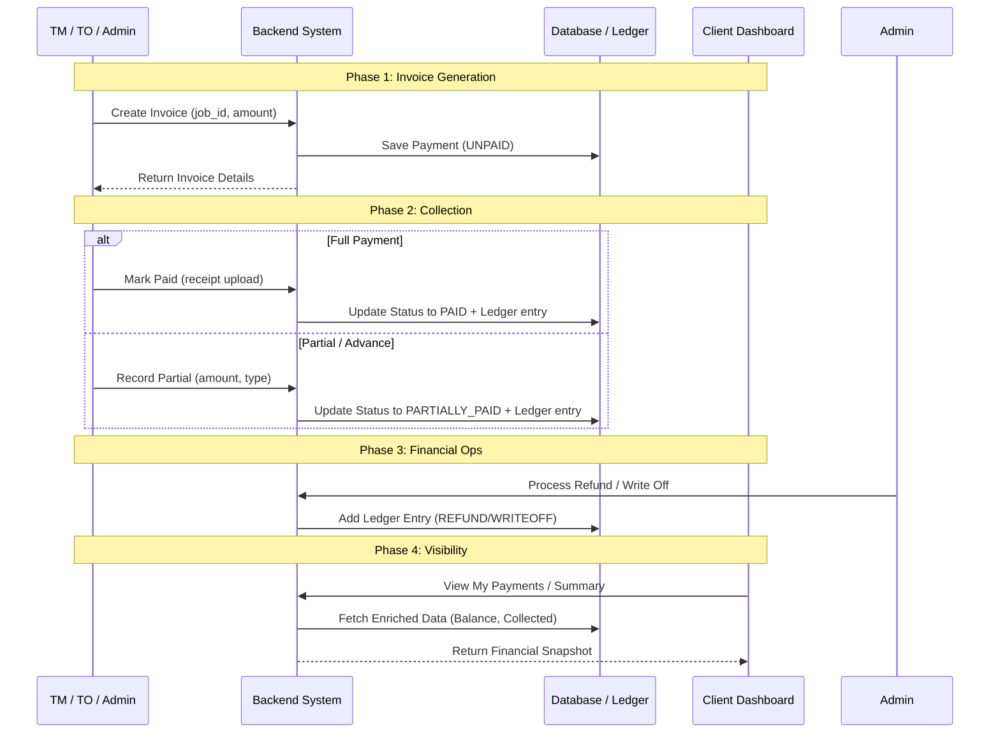

# Payment Module Role-Wise Flow

This document outlines the end-to-end payment lifecycle within the GR-CLASS platform, detailing roles, actions, and technical specifications for each step.

---

## 1. Role-Based Access Control (RBAC) Matrix

| Action | Admin | GM | TM / TO | Client |
| :--- | :---: | :---: | :---: | :---: |
| List & View Payments | ✅ | ✅ | ✅ | ✅ (Own) |
| Create Invoice | ✅ | ✅ | ✅ | ❌ |
| Mark Paid (Full Settlement) | ✅ | ✅ | ✅ | ❌ |
| Record Partial/Advance Payment | ✅ | ✅ | ✅ | ❌ |
| View Financial Summary | ✅ | ✅ | ❌ | ✅ (Own) |
| View Ledger (History) | ✅ | ✅ | ❌ | ❌ |
| Process Refund | ✅ | ✅ | ❌ | ❌ |
| Write Off Payment | ✅ | ❌ | ❌ | ❌ |

---

## 2. High-Level Flow Sequence



---

## 3. API Reference & Payloads

### 3.1 Create Invoice
**Role:** ADMIN, GM, TM, TO  
**Endpoint:** `POST /api/v1/payments/invoice`

**Request Payload:**
```json
{
  "job_id": "9a2b3c4d-5e6f-7g8h-9i0j-k1l2m3n4o5p6",
  "amount": 1500.50,
  "currency": "USD"
}
```

**Success Response:**
```json
{
  "success": true,
  "data": {
    "id": 10,
    "job_id": "...",
    "invoice_number": "INV-A1B2C3D4",
    "amount": "1500.50",
    "currency": "USD",
    "payment_status": "UNPAID",
    "created_at": "2024-05-10T10:00:00.000Z"
  }
}
```

---

### 3.2 Mark Paid (Full Settlement)
**Role:** ADMIN, GM, TM, TO  
**Endpoint:** `PUT /api/v1/payments/:id/pay`  
**Content-Type:** `multipart/form-data`

**Request Body:**
- `receipt`: (File) - Proof of payment (PDF/Image)
- `remarks`: (String) - Optional notes

**Success Response:**
```json
{
  "success": true,
  "data": {
    "id": 10,
    "payment_status": "PAID",
    "payment_date": "2024-05-11T12:00:00.000Z",
    "receipt_url": "https://s3.bucket/receipts/payments/txn_123.pdf"
  }
}
```

---

### 3.3 Record Partial / Advance Payment
**Role:** ADMIN, GM, TM, TO  
**Endpoint:** `POST /api/v1/payments/:id/partial`

**Request Payload:**
```json
{
  "amount": 500.00,
  "type": "ADVANCE", 
  "remarks": "Initial 30% advance collected"
}
```
*Note: `type` can be `ADVANCE` or `PARTIAL_PAYMENT`.*

**Success Response:**
```json
{
  "success": true,
  "data": {
    "id": 10,
    "amount_paid": "500.00",
    "remaining": "1000.50",
    "payment_status": "PARTIALLY_PAID"
  }
}
```

---

### 3.4 Process Refund
**Role:** ADMIN, GM  
**Endpoint:** `POST /api/v1/payments/:id/refund`

**Request Payload:**
```json
{
  "amount": 200.00,
  "reason": "Overpayment or job cancellation"
}
```

**Success Response:**
```json
{
  "success": true,
  "data": {
    "id": 10,
    "refunded_amount": "200.00"
  }
}
```

---

### 3.5 Write Off Payment
**Role:** ADMIN  
**Endpoint:** `POST /api/v1/payments/writeoff`

**Request Payload:**
```json
{
  "paymentId": 10,
  "reason": "Bad debt or administrative waiver"
}
```

**Success Response:**
```json
{
  "success": true,
  "data": {
    "id": 10,
    "payment_status": "ON_HOLD"
  }
}
```

---

## 4. Visibility & Data Enrichment

When fetching payments (List or Get By ID), the system calculates real-time financial data from the ledger:

- **Amount Collected:** Total of all `ADVANCE` + `PARTIAL_PAYMENT` + `PAYMENT` entries.
- **Refunded Amount:** Total of all `REFUND` entries.
- **Remaining Balance:** `Invoice Amount` - `Amount Collected` + `Refunded Amount`.
- **Net Amount:** `Invoice Amount` - `Refunded Amount`.

**Client Visibility:** Clients only see payments linked to their vessels. They can access the `/summary` endpoint to see their total outstanding balance across all jobs.
